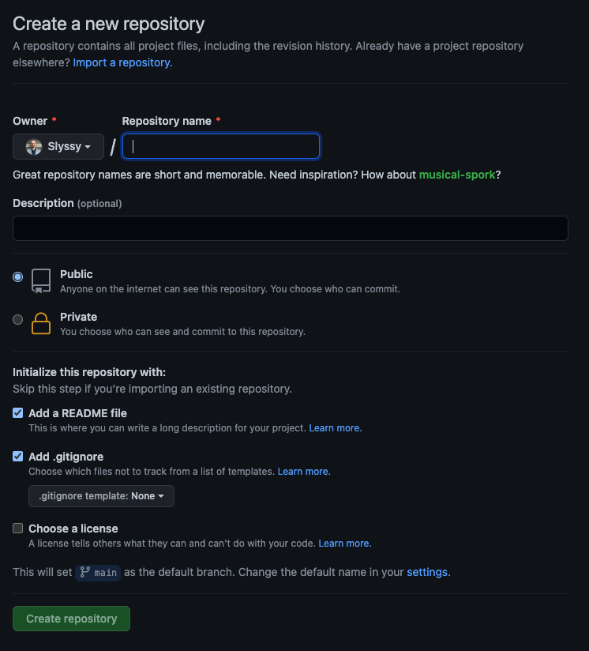
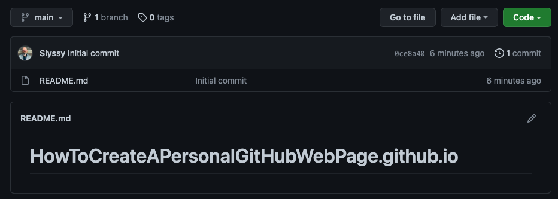
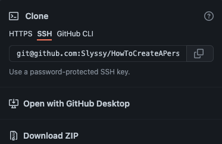
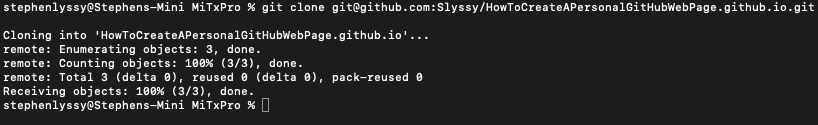
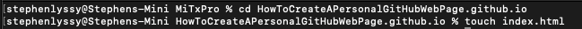
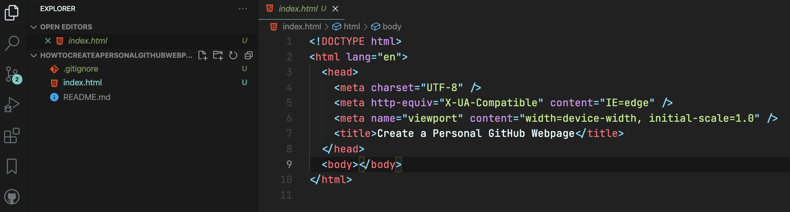
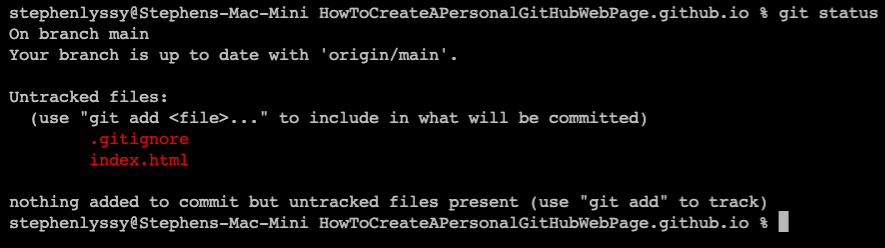
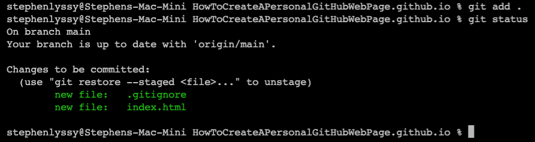
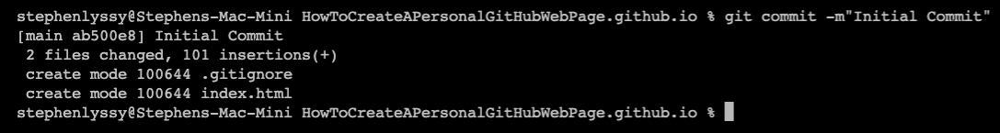
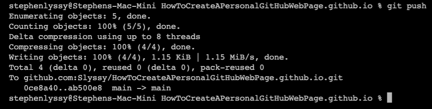

# Create a Personal Page on GitHub

**Note:** _There are many ways to create and deploy a personal page on
GitHub. 
This is how I do it._

### Step 1: Create a GitHub Account

1. Log onto GitHub by going to www.github.com
2. Click on the green box that says "New" in the repositories section. This
   should take you to a page that looks like this.  
     
3. Your repository name should be in the following
   format...  **[repositoryname].github.io**  
   You should always include a ReadMe file, and if you want to add a
   gitignore file you can select the checkbox. If you
   create .gitignore file, you will need to select a template.
   After you select your option click "Create repository". That will take
   you to a page like this.  
     
4. At this point, you simply need to select the green "Code" button.
   That will pop up a dialogue box like this.  
     
5. Copy the SSH Link.
6. Now you will need to open your terminal and navigate to where you want
   your directory on your local machine.
7. Once you are where you want to be type the following...  
   **git clone [paste the ssh link you copied]** and press "Enter".  
   Your terminal should look something like this...  
     
8. Back in your terminal create a new index.html file by typing...  
   **touch index.html**  
   _Note: Make sure you are in the correct file in your terminal._  
     
9. Now open the folder you just created in VSCode. It should look something like
   this...  
     
   _Note: I created the HTML template by typing ![enter] on the first line of
   the index.html file._  
10. Now that your files are created, you need to push the changes to your GitHub
    Repository. This can be done by first opening the terminal in VSCode.   _VSCode
    makes it really easy to access the terminal. While in VSCode simply hold
    down..._   Control + `  
11. Now that the terminal is open type the following...  
    **git status**  
    _Your terminal should look like this..._
      
    _Note: This will tell you what files have been changed or added on your local
    machine that are different from what are in the GitHub repository. The
    updated files will appear in red._  
    Now type...  
    **git add .**  
    _Note: This adds the files to the queue to be committed. To confirm this, type..._   
    **git status**  
    _Your terminal should look like this..._
      
    _Note: The file names are now green._  
    Now type...  
    **git commit -m"Initial Commit"**  
    \*Note: All commits must include a message to explain what is being
    committed. That is what -m" " flag indicates.  
    _Your terminal should look like this..._
      
    Finally type the following to push the changes to the gitHub repository...  
    **git push**  
    _Your terminal should look like this..._
      
12. Now that you have pushed your changes to your GitHub repository, your GitHub
    repository should look something like this...  
      
13. Now you can go
    to your browser and type in the repository name you created in step 3 to
    access your deployed GitHub page.
